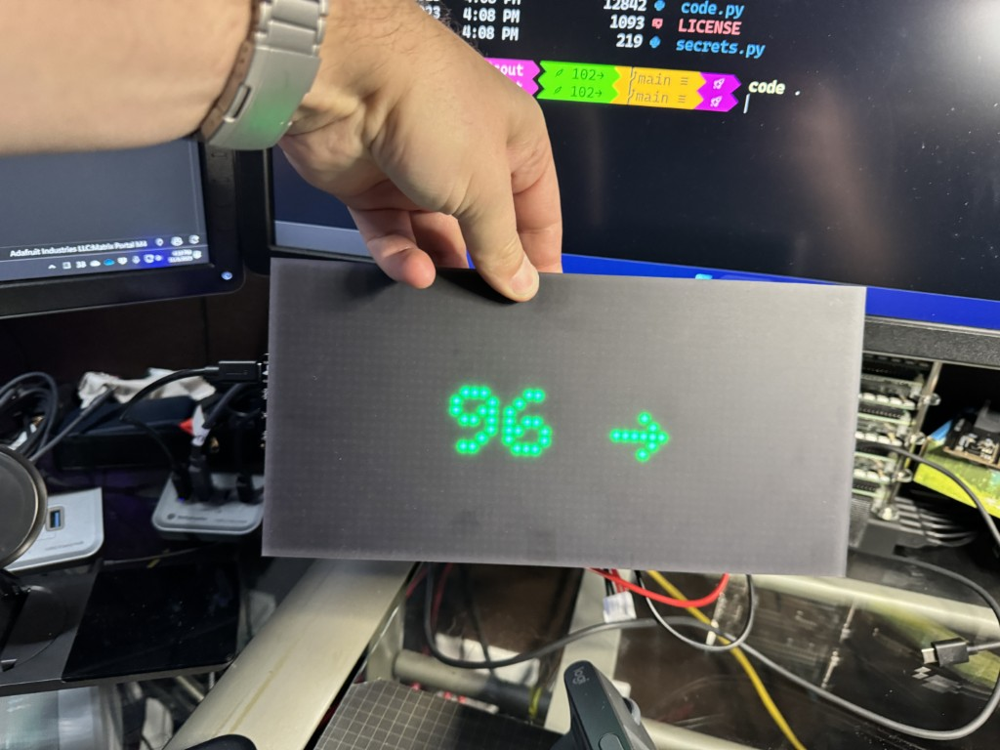

# AdaFruitM4MatrixWithNightScout

This project is designed to pull data from Nightscout and display your blood sugar levels in near real-time (every 5 min) on an [Adafruit M4 MatrixPortal Display](https://learn.adafruit.com/adafruit-matrixportal-m4/overview)

## Prerequisites

To use this project, you will need the following:

- An Adafruit M4 MatrixPortal Display
- CircuitPython on the M4 (should be there by default)
- A USB cable to connect your device to your computer

## Installation

1. Clone the code from this repository.
2. Connect your Adafruit M4 Matrix Display to your computer via USB.
3. Copy the code to the M4 device's disk drive.
4. Disconnect your device from your computer.

## Usage

Once you have installed the code on your device, it will automatically pull data from Nightscout and display your blood sugar levels on the Adafruit M4 Matrix Display.

Please note that this project requires CircuitPython to be installed on your device. If you do not have CircuitPython installed, please refer to the [CircuitPython Setup Guide](https://learn.adafruit.com/adafruit-matrixportal-m4/circuitpython-setup) for instructions.
